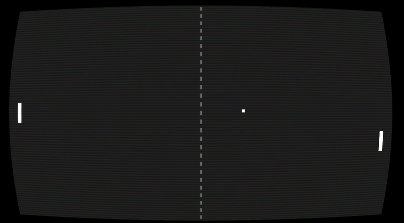

# OpenGL Projects

## Pong


This repository contains all of my OpenGL projects.

## Requirements

To run these projects, you must have the following dependencies installed in your compiler's include directory:
- `glad/glad.h`
- `GLFW/glfw3.h`
- Other necessary OpenGL dependencies

## OpenGL Version

All projects in this repository are developed using OpenGL version 3.3.

## Compilation Example

To compile one of the projects (for example, Pong), follow these steps:

```bash
git clone "https://github.com/dudujuju828/OpenGL"
cd OpenGL/Pong
make
